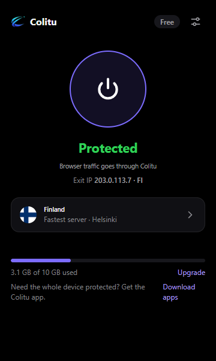
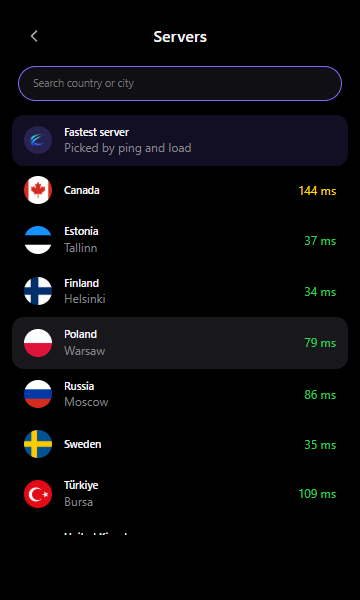
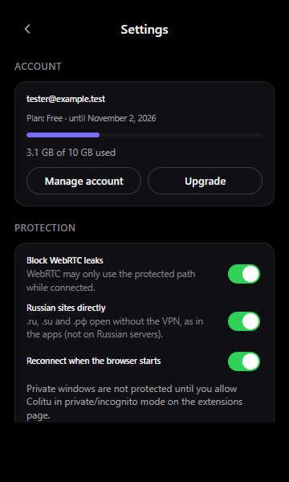
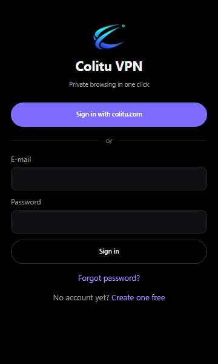

# Colitu VPN for Chrome and Firefox

[](https://github.com/colitu/colitu-extension/actions/workflows/ci.yml)
[](https://github.com/colitu/colitu-extension/releases/latest)
[](LICENSE)
[](https://status.colitu.com)

The open-source browser extension of [Colitu VPN](https://colitu.com). It
protects the browser without installing an app: sign in with your Colitu
account, click once, and the browser's traffic leaves through a Colitu server.

| | |
|---|---|
| Browsers | Chrome, Edge, Brave, Opera, Yandex Browser (Chrome Web Store) · Firefox 128+ (Firefox Add-ons) |
| Version | `1.0.0` (`package.json`) |
| Manifest | V3 (Chrome service worker, Firefox event page) |
| Languages | Russian, English, Turkish |
| Dependencies | none at runtime; the build script uses only Node.js |
| License | [GPL-3.0](LICENSE) |

<p align="center">
  
  
  
  
</p>

**Install:** [colitu.com/download/browser](https://colitu.com/download/browser) · [Releases](../../releases)

## How it works

Browsers can only use HTTP, HTTPS and SOCKS proxies, so the extension does not
run the app transports (VLESS Reality, XHTTP, Hysteria2). Instead:

1. The extension signs in like an app device (`/api/v1/auth/*`,
   `/api/v1/devices/register`, platform `chrome` or `firefox`) or through the
   device link (a code you confirm on colitu.com). Tokens stay in extension
   storage.
2. It asks the panel for a **proxy ticket** and the server list
   (`POST /api/v1/webproxy/session`). A ticket is a short-lived (≤ 6 h),
   Ed25519-signed statement "this device of this user may use the proxy until
   …". It is refreshed in the background.
3. While connected, the browser talks to an **HTTPS proxy** (TLS, HTTP/2) on
   the chosen node; the ticket is the proxy password. Chrome gets a PAC script
   through `chrome.proxy`; Firefox answers `proxy.onRequest` per request.
   Both use the same routing function ([`src/lib/routing.js`](src/lib/routing.js)).
4. The node verifies tickets offline, counts traffic per device and reports it
   to the panel, which counts it towards the plan (the free plan has 10 GB a
   month) and tells the node to cut off ended plans and removed devices.

The proxy chain has **no `DIRECT` fallback** for websites: if the server
cannot be reached, pages fail instead of leaking around the proxy. Only the
Colitu API itself may fall back to a direct connection, so you can still sign
in and switch servers.

### What goes direct

- the Colitu proxy hosts themselves and local network addresses
  (`localhost`, `10/8`, `172.16/12`, `192.168/16`, `169.254/16`, `100.64/10`,
  `fc00::/7`, `fe80::/10`, `.local`, …);
- your own bypass list, or everything except your list in “only these sites”
  mode;
- `.ru`, `.su`, `.рф` sites while **Russian sites directly** is on (default,
  as in the apps) and the server is not in Russia.

### WebRTC

While connected (and the setting is on), `privacy.network.webRTCIPHandlingPolicy`
is set to `disable_non_proxied_udp`, so WebRTC cannot reveal the real address.
It is cleared when you disconnect.

## Permissions

| Permission | Why |
|---|---|
| `proxy` | set the browser proxy (Chrome) / answer per-request proxy decisions (Firefox) |
| `<all_urls>` host access | route every site through the proxy, measure server ping, call the Colitu API |
| `webRequest`, `webRequestAuthProvider` (Chrome) | answer the proxy's authentication challenge with the ticket |
| `privacy` | the WebRTC protection |
| `storage` | session tokens, settings and the server list |
| `alarms` | refresh the ticket in the background |

The extension does not read page content, inject scripts into pages, keep a
browsing history or use analytics. See [PRIVACY.md](PRIVACY.md).

## Building

Requires Node.js 20 or newer; there are no npm dependencies.

```
npm test              # routing, PAC, Firefox decisions, translations
npm run build         # dist/chrome, dist/firefox, store zips, SHA256SUMS
```

`node scripts/build.mjs chrome` builds one browser. Zips are reproducible
(fixed timestamps, sorted entries): building the same tag gives the same
SHA-256 as the release. Load `dist/chrome` with *Load unpacked* on
`chrome://extensions` (Developer mode), or `dist/firefox/manifest.json` from
`about:debugging` in Firefox.

`--api=<url>` points a build at another API for local testing; the output goes
to `dist-dev/` and is never published.

## Repository layout

| Path | |
|---|---|
| `src/background.js` | session, proxy setting, authentication, toolbar icon |
| `src/lib/api.js` | Colitu API client (tokens, device registration, tickets) |
| `src/lib/routing.js` | what goes through the proxy; PAC generation |
| `src/lib/proxy.js` | Chrome PAC / Firefox `onRequest`, WebRTC policy |
| `src/lib/i18n.js` | UI strings (en, ru, tr) |
| `src/popup/` | the popup UI |
| `scripts/build.mjs` | per-browser manifests and reproducible zips |
| `store/` | store listing texts and images |

## Related repositories

- [colitu/colitu-windows](https://github.com/colitu/colitu-windows) · [colitu/colitu-android](https://github.com/colitu/colitu-android) · [colitu/colitu-linux](https://github.com/colitu/colitu-linux)

Security reports: [SECURITY.md](SECURITY.md). Contributions: [CONTRIBUTING.md](CONTRIBUTING.md).

Flag images: [flag-icons](https://github.com/lipis/flag-icons) (MIT), see [NOTICE](NOTICE).
